<div align="center">


#  5-Stage Pipelined RV32I RISC-V Processor
### Full ASIC RTL-to-GDSII Implementation

**Course:** ASIC Design — MVLD505 | **Institution:** Vellore Institute of Technology  
**Submitted to:** Dr. Raghunath G — Dept. of Micro and Nanoelectronics

 
> Author — **Syed Faheem**
> M.Tech VLSI Design — VIT Vellore 

</div>

---

## Team

| Sreehari R | Karthika GS | Syed Faheem | Abhinav P | MP Fardeen | Joel M Jacob |
|---|---|---|---|---|---|

---

##  Abstract

This project presents the complete **RTL-to-GDSII** design and implementation of a **5-stage pipelined RV32I RISC-V processor** integrated with a **UART peripheral**, targeting ASIC implementation using Synopsys industry-standard EDA tools.

The processor implements the RV32I base integer instruction set on a classical 5-stage pipeline — **Instruction Fetch (IF)**, **Instruction Decode (ID)**, **Execute (EX)**, **Memory Access (MEM)**, and **Write-Back (WB)** — with full hazard handling via forwarding logic, pipeline stalling, and flush mechanisms.

| Tool | Purpose |
|---|---|
| Synopsys VCS | Functional Simulation |
| Synopsys Design Compiler | Logic Synthesis (SAED 14nm) |
| Synopsys Formality | Formal Equivalence Verification |
| Synopsys PrimeTime | Static Timing Analysis & ECO |
| Synopsys IC Compiler II | Physical Implementation → GDSII |

---

##  Repository Structure

```
├── src/                        # RTL Source Files (Verilog)
│   ├── Microprocessor.v        # Top-level integration
│   ├── Core.v                  # Processor core
│   ├── Fetch.v                 # IF stage
│   ├── Decode.v                # ID stage
│   ├── Execute.v               # EX stage
│   ├── Memory1.v               # MEM stage
│   ├── Write_back.v            # WB stage
│   ├── fetch_pipe.v            # IF/ID pipeline register
│   ├── decode_pipe.v           # ID/EX pipeline register
│   ├── execute_pipe.v          # EX/MEM pipeline register
│   ├── memstage_pipe.v         # MEM/WB pipeline register
│   ├── alu.v                   # Arithmetic Logic Unit
│   ├── control_unit.v          # Control signal generator
│   ├── control_decoder.v       # Instruction decoder
│   ├── type_decoder.v          # Instruction type decoder
│   ├── immediate_gen.v         # Immediate value generator
│   ├── register_file.v         # 32×32 register file
│   ├── program_counter.v       # PC register
│   ├── branch.v                # Branch evaluation logic
│   ├── adder.v                 # PC adder
│   ├── mux1_2.v / mux2_4.v / mux3_8.v  # Multiplexers
│   ├── instruc_mem_top.v       # Instruction memory wrapper
│   ├── data_memory_top.v       # Data memory wrapper
│   ├── memory.v                # Memory model
│   ├── wrapper_memory.v        # SRAM wrapper
│   ├── Microprocessor_tb.v     # Top-level testbench
│   ├── tb_decode.v             # Decode stage testbench
│   └── instr.mem               # Instruction memory init file
│
├── dc/                         # Logic Synthesis — Design Compiler
│   ├── review2_dc_script.tcl   # Main synthesis script
│   ├── cu_dc_script.tcl        # CU synthesis script
│   ├── microprocessor_netlist.v      # Gate-level netlist output
│   ├── microprocessor_constraints.sdc
│   ├── microprocessor_area.rpt
│   ├── microprocessor_timing.rpt
│   ├── microprocessor_power.rpt
│   └── microprocessor_qor.rpt
│
├── fm/                         # Formal Verification — Formality
│   ├── review2_fm_script.tcl
│   ├── microprocessor_design_report.rpt
│   └── microprocessor_matched_point.rpt
│
├── pt/                         # Static Timing Analysis — PrimeTime
│   ├── decoder_pt_script.tcl
│   ├── add_buffer_netlist.tcl  # ECO buffer insertion script
│   ├── hold.timing.rpt
│   ├── su.timing.rpt
│   └── timing.rpt
│
├── icc2/                       # Physical Design — IC Compiler II
│   ├── decoder_icc2.tcl        # Full PnR script
│   ├── decoder.sdc             # Timing constraints
│   ├── decoder.sdf             # Standard delay format
│   ├── decoder_all_netlist.v   # Post-layout netlist (all cells)
│   └── decoder_physical_netlist.v  # Physical netlist
│
└── docs/                       # Report figures (see below)
```

---

##  Table of Contents

1. [Introduction](#1-introduction)
2. [RISC-V Architecture Overview](#2-risc-v-architecture-overview)
3. [System Architecture & RTL Design](#3-system-architecture--rtl-design)
4. [Pipeline Stages & Hazard Handling](#4-pipeline-stages--hazard-handling)
5. [Functional Verification — VCS Simulation](#5-functional-verification--vcs-simulation)
6. [Logic Synthesis — Design Compiler](#6-logic-synthesis--design-compiler)
7. [Formal Verification — Formality](#7-formal-verification--formality)
8. [Static Timing Analysis — PrimeTime](#8-static-timing-analysis--primetime)
9. [Physical Design — IC Compiler II](#9-physical-design--ic-compiler-ii)
10. [Results Summary](#10-results-summary)
11. [Conclusion](#11-conclusion)
12. [Acknowledgements](#12-acknowledgements)
13. [References](#13-references)

---

## 1. Introduction

Modern processor design demands a careful balance between **performance**, **power efficiency**, and **design complexity**. The RISC-V ISA has emerged as a compelling open-source alternative to proprietary ISAs, offering modularity and simplicity ideal for both academic research and industry.

### 1.1 Objectives

- ✅ Design a **5-stage pipelined RV32I RISC-V** processor in Verilog HDL
- ✅ Perform functional verification using **Synopsys VCS** simulation
- ✅ Synthesize using **Synopsys Design Compiler** with SAED 14nm technology
- ✅ Perform formal equivalence checking using **Synopsys Formality**
- ✅ Perform static timing analysis and ECO fixing using **Synopsys PrimeTime**
- ✅ Complete physical design flow using **Synopsys IC Compiler II**
- ✅ Analyze timing, area, and power at each stage of the design flow

---

## 2. RISC-V Architecture Overview

RISC-V is an open-source ISA based on Reduced Instruction Set Computing (RISC) principles. The **RV32I** base integer instruction set defines a **32-bit architecture** with **32 general-purpose registers**, fixed 32-bit instruction encoding, and six instruction formats:

| Format | Type | Example Instructions |
|---|---|---|
| **R-type** | Register-Register | ADD, SUB, AND, OR, XOR, SLL, SRL, SRA |
| **I-type** | Immediate | ADDI, LW, LH, LB, JALR, SLLI |
| **S-type** | Store | SW, SH, SB |
| **B-type** | Branch | BEQ, BNE, BLT, BGE, BLTU, BGEU |
| **U-type** | Upper Immediate | LUI, AUIPC |
| **J-type** | Jump | JAL |

---

## 3. System Architecture & RTL Design

The processor is organized as a classical **5-stage Harvard pipeline** with separate instruction and data memories implemented as SRAM macros (`SRAM1RW256x32`). The top-level module (`Microprocessor.v`) integrates the processor core, UART peripheral, instruction memory, and data memory.

### 3.1 Datapath Components

| Component | File | Description |
|---|---|---|
| **Program Counter** | `program_counter.v` | 32-bit register holding current instruction address |
| **Instruction Memory** | `instruc_mem_top.v` | `SRAM1RW256x32` macro — 256 words × 32 bits |
| **Register File** | `register_file.v` | 32 × 32-bit registers, 2 read ports, 1 write port |
| **ALU** | `alu.v` | ADD/SUB, AND/OR/XOR, shift, comparison |
| **Immediate Generator** | `immediate_gen.v` | Sign-extends immediate fields to 32 bits |
| **Data Memory** | `data_memory_top.v` | `SRAM1RW256x32` macro — 256 words × 32 bits |
| **Control Unit** | `control_unit.v` | Generates all datapath control signals |
| **Type Decoder** | `type_decoder.v` | Identifies instruction format |
| **Control Decoder** | `control_decoder.v` | Decodes opcode to control signals |
| **Branch Logic** | `branch.v` | Evaluates branch conditions, updates PC |
| **Adder** | `adder.v` | PC+4 / branch target computation |

---

## 4. Pipeline Stages & Hazard Handling

### 4.1 Five Pipeline Stages

```
┌──────────┬──────────┬──────────┬──────────┬──────────┐
│    IF    │    ID    │    EX    │   MEM    │    WB    │
│ Fetch.v  │ Decode.v │Execute.v │Memory1.v │Write_    │
│          │          │          │          │back.v    │
│fetch_    │decode_   │execute_  │memstage_ │          │
│pipe.v    │pipe.v    │pipe.v    │pipe.v    │          │
└──────────┴──────────┴──────────┴──────────┴──────────┘
```

| Stage | File | Function |
|---|---|---|
| **IF** | `Fetch.v` | Fetches instruction at PC, updates PC to PC+4 or branch target |
| **ID** | `Decode.v` | Decodes instruction, reads register file, generates immediates |
| **EX** | `Execute.v` | ALU operation; forwarding muxes select correct operands |
| **MEM** | `Memory1.v` | Load/store data memory access |
| **WB** | `Write_back.v` | Writes result back to register file |

### 4.2 Hazard Resolution

| Hazard Type | Resolution |
|---|---|
| **Data Hazards (RAW)** | Forwarding from EX/MEM and MEM/WB pipeline registers to EX stage ALU inputs |
| **Load-Use Hazard** | One-cycle stall; NOP bubble injected into EX stage while IF and ID are frozen |
| **Control Hazards** | On taken branch, IF and ID stages flushed with NOP bubbles |

---

## 5. Functional Verification — VCS Simulation

Verification performed using **Synopsys VCS V-2023.12-SP2**. Waveforms analyzed in **Synopsys Verdi**.

| Test | Instructions | Focus | Result |
|---|---|---|---|
| Test 1 | ADD, SUB, AND, OR, XOR | R-type arithmetic & logic | ✅ PASS |
| Test 2 | ADDI, ANDI, ORI | I-type immediate operations | ✅ PASS |
| Test 3 | LW, SW, LH, SH | Load and store memory access | ✅ PASS |
| Test 4 | BEQ, BNE, BLT, BGE | Branch and control flow | ✅ PASS |
| Test 5 | JAL, JALR | Jump and link | ✅ PASS |
| Test 6 | Forwarding sequences | RAW hazard via forwarding | ✅ PASS |
| Test 7 | Load-use sequence | Stall insertion | ✅ PASS |
| Test 8 | UART TX/RX | Serial communication | ✅ PASS |

All 8 test cases passed — correct pipeline execution, forwarding paths, stall logic, branch flushing, and UART data transfer confirmed.

---

## 6. Logic Synthesis — Design Compiler

Synthesis performed using **Synopsys Design Compiler V-2023.12-SP4** targeting **SAED 14nm**.  
→ Scripts: [`dc/review2_dc_script.tcl`](dc/review2_dc_script.tcl)

### Synthesis Configuration

| Parameter | Value |
|---|---|
| Technology | SAED 14nm EDK (RVT/HVT/LVT) |
| Operating Conditions | FF corner: 0.715V, 125°C |
| Target Clock Period | 5.0 ns (200 MHz) |
| Clock Uncertainty (Setup/Hold) | 0.3 ns / 0.05 ns |
| Compile Strategy | `compile_ultra` + `set_fix_hold` + `compile_ultra -incremental` |

### 6.1 Area Report

> **Figure 1: DC Synthesis Area Report — Total Area: 137,197.96 µm²**

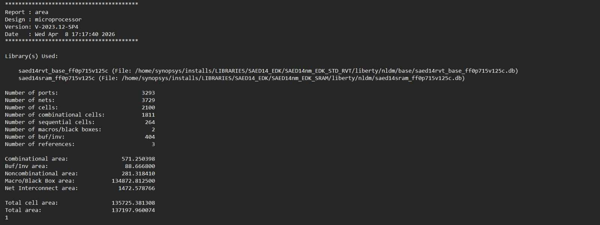

| Metric | Value |
|---|---|
| Total Cells | 2,100 |
| Combinational Cells | 1,811 |
| Sequential Cells (Flip-Flops) | 264 |
| Macros / Black Boxes | 2 (SRAM instances) |
| Combinational Area | 571.25 µm² |
| Noncombinational Area | 281.32 µm² |
| Macro/Black Box Area | 134,872.81 µm² |
| Net Interconnect Area | 1,472.58 µm² |
| **Total Design Area** | **137,197.96 µm²** |

> SRAM macros dominate at **98.3%** of total area — typical for memory-intensive microprocessor designs.

---

## 7. Formal Verification — Formality

Equivalence checking performed using **Synopsys Formality** to confirm the synthesized netlist is logically identical to the RTL.  
→ Script: [`fm/review2_fm_script.tcl`](fm/review2_fm_script.tcl)

> **Figure 2: Formality Verification — SUCCEEDED, 88/88 compare points passing**

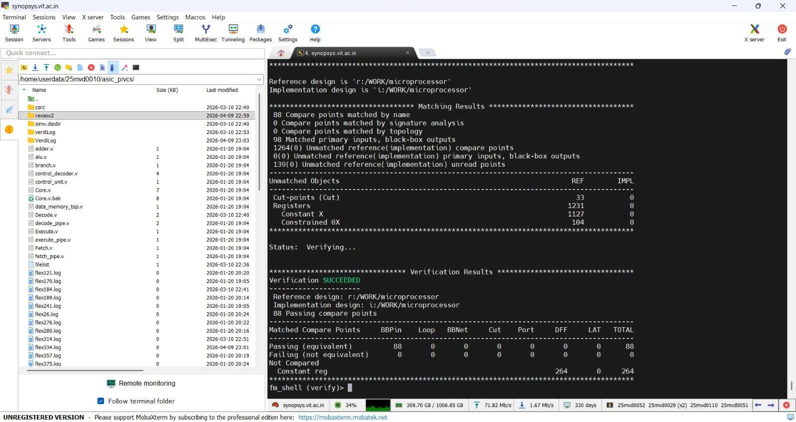

| Metric | Value |
|---|---|
| **Verification Status** | ✅ SUCCEEDED |
| Passing Compare Points | **88 / 88 (100%)** |
| Failing Compare Points | 0 |
| Matched Primary Inputs / BB Outputs | 98 |

---

## 8. Static Timing Analysis — PrimeTime

STA performed using **Synopsys PrimeTime**.  
→ Scripts: [`pt/decoder_pt_script.tcl`](pt/decoder_pt_script.tcl), [`pt/add_buffer_netlist.tcl`](pt/add_buffer_netlist.tcl)

### 8.1 Before ECO

> **Figure 3: PrimeTime Endpoints — Before ECO: 263 hold violations, WNS = -0.262 ns**

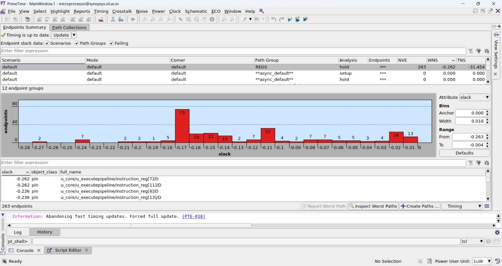

### 8.2 QoR Report

> **Figure 4: PrimeTime QoR Report**

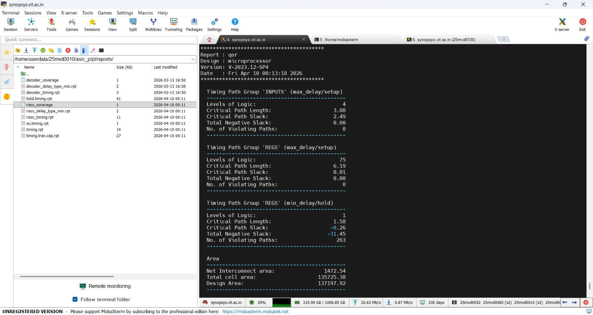

| Path Group | Analysis | Critical Path Slack | Violations |
|---|---|---|---|
| INPUTS | max/setup | +2.49 ns ✅ | 0 |
| REGS | max/setup | +0.01 ns ✅ | 0 |
| REGS | min/hold | -0.26 ns ❌ | 263 |

### 8.3 ECO Fix Summary

> **Figure 5: ECO Summary — 1,098 buffers inserted, 252/263 violations fixed (95.8%)**

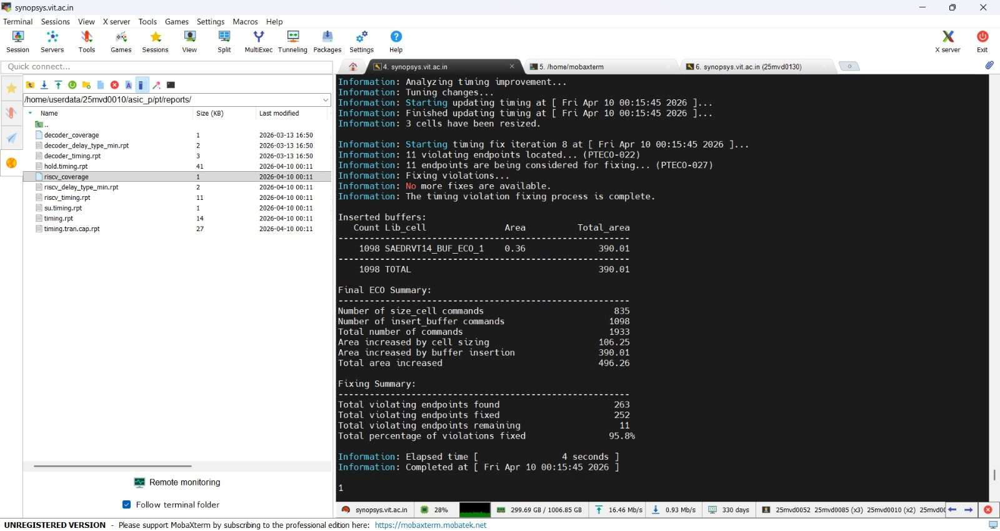

| ECO Metric | Value |
|---|---|
| Violations Fixed | 252 / 263 (95.8%) |
| Remaining | 11 (SRAM macro paths only) |
| Buffers Inserted | 1,098 (`SAEDRVT14_BUF_ECO_1`) |
| Cell Resizing Commands | 835 |
| Total Area Increase | 496.26 µm² |
| ECO Iterations | 8 |

### 8.4 After ECO

> **Figure 6: After ECO — 11 remaining violations, WNS = -0.040 ns (SRAM paths only)**

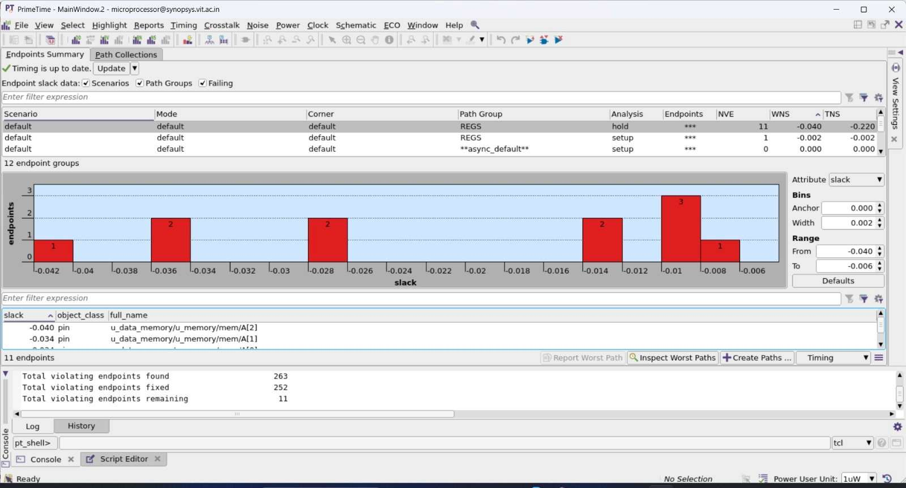

| Metric | Before ECO | After ECO |
|---|---|---|
| Hold Violations | 263 | 11 |
| WNS (Hold) | -0.262 ns | -0.040 ns |
| TNS (Hold) | -31.454 ns | -0.220 ns |

---

## 9. Physical Design — IC Compiler II

Full PnR flow executed using **Synopsys IC Compiler II**.  
→ Script: [`icc2/decoder_icc2.tcl`](icc2/decoder_icc2.tcl)

### 9.1 Floorplan

> **Figure 7: Floorplan — Two SRAM1RW256x32 macros placed symmetrically**

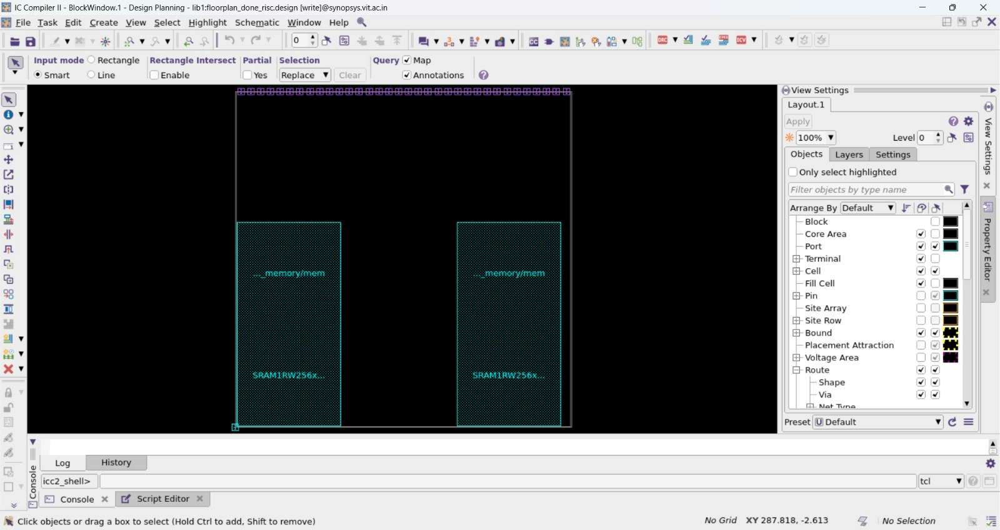

Two `SRAM1RW256x32` macros placed side-by-side in the lower core half. Standard cells occupy the upper region. Symmetric placement minimises routing congestion.

### 9.2 Power Plan

> **Figure 8: Power Plan — Rings and stripes around core and SRAM macros**

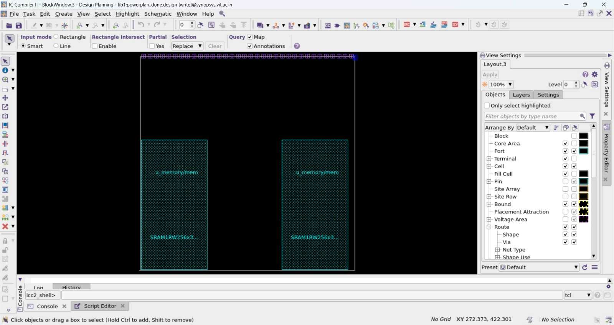

PDN includes power rings around each macro and the core boundary, with vertical and horizontal stripes for uniform VDD/VSS delivery at 200 MHz.

### 9.3 Placement

> **Figure 9: Placement — Standard cells placed alongside SRAM macros**

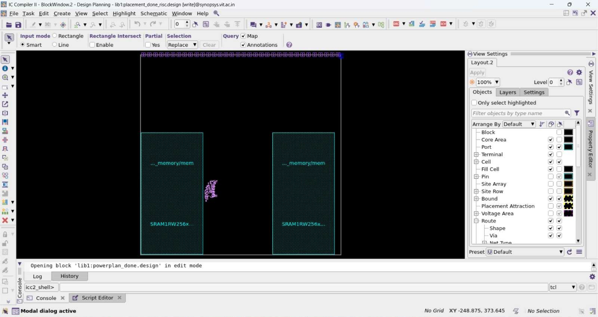

### 9.4 Clock Tree Synthesis (CTS)

> **Figure 10: CTS — Balanced clock tree to all 264 flip-flop clock pins**

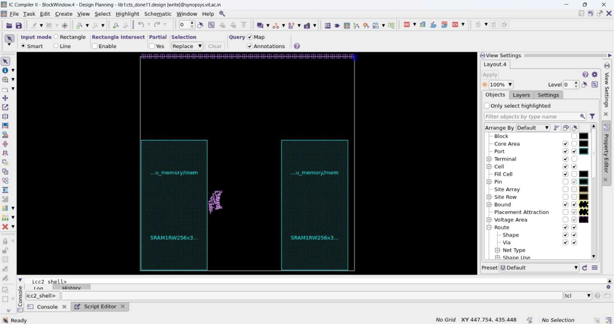

4-level clock tree (level0: 2, level1: 3, level2: 3, level3: 266 sinks). SAED14nm clock buffers optimised for low skew and low power.

### 9.5 Initial Routing

> **Figure 11: Initial Route — All signal nets routed through metal layers**


M1–M3 for local connections; upper metals for global routes.

### 9.6 Final Routing

> **Figure 12: Final Route (route_done) — DRC-clean layout ready for GDSII**

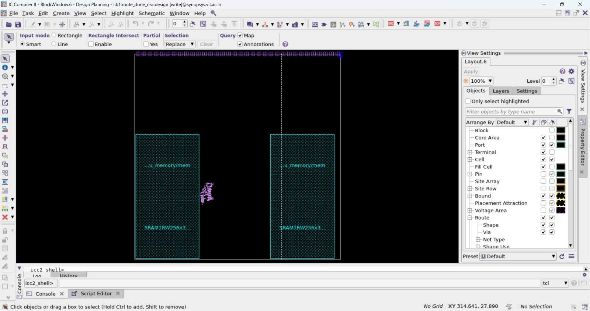

### 9.7 Sign-off

#### Cell Density

> **Figure 13: Cell Density Profile**

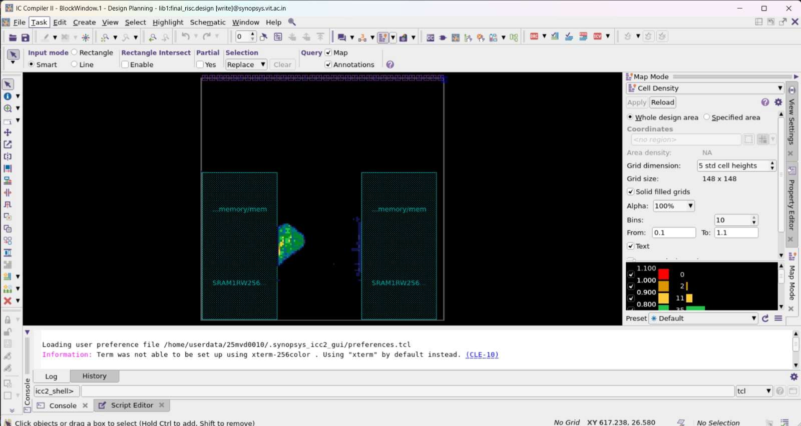

Density range 0.1–1.1. Low overall density reflects large SRAM footprint, providing unobstructed routing paths.

#### Pin Density

> **Figure 14: Pin Density Analysis**

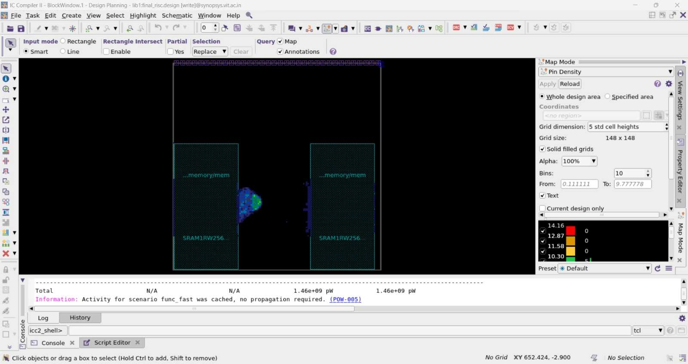

Standard cell area: 0.1–9.78 pins per unit area.

#### Power Density

> **Figure 15: Power Density Distribution**

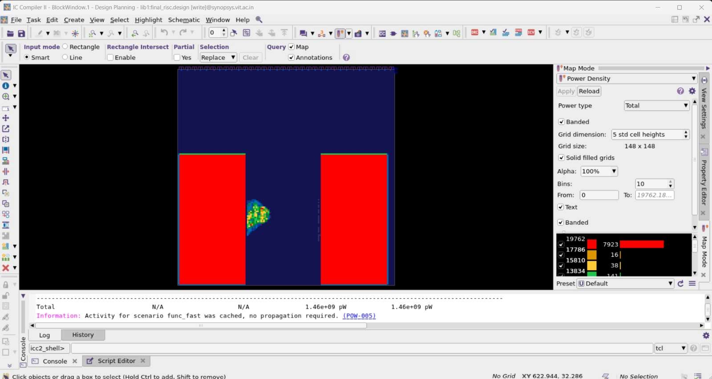

| Metric | Value |
|---|---|
| Peak Power Density | ~19,762 pW (SRAM regions) |
| **Total Design Power** | **1.46 W** |

#### Clock Distribution

> **Figure 16: Hierarchical Clock Distribution Network**

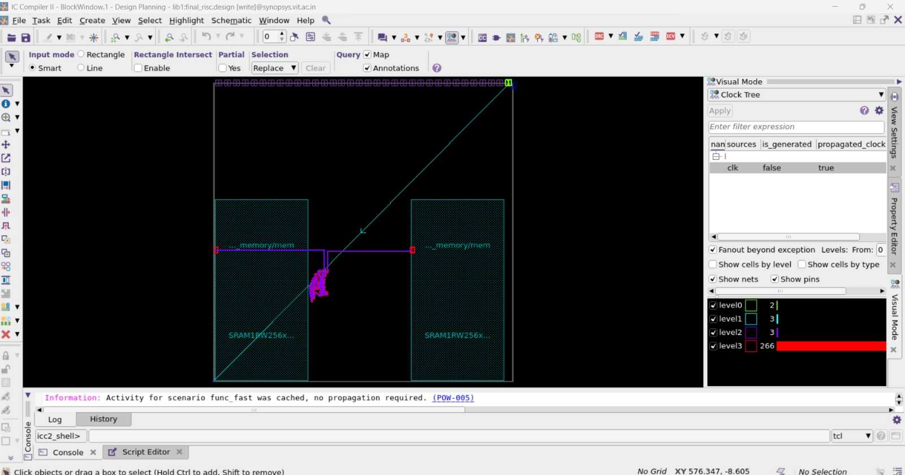

#### Schematic / Block Diagram

> **Figure 17: Layout and Block Architecture**

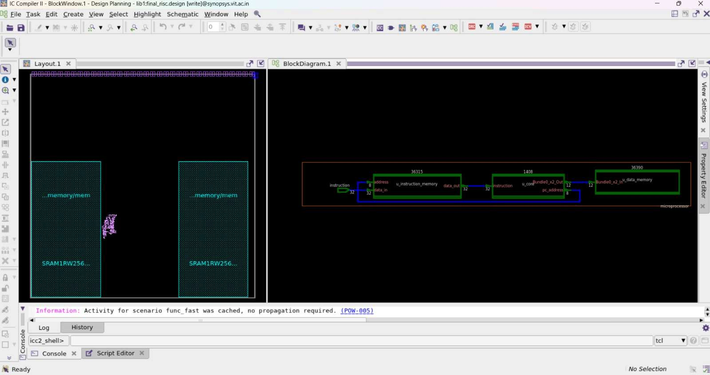

#### DRC Error Browser

> **Figure 18: DRC Error Browser — 217 violations (reduced from >100,000)**

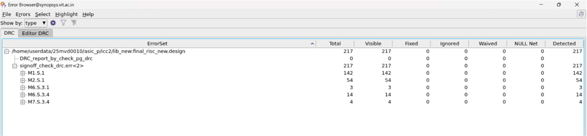

| Layer | Violations |
|---|---|
| M1.S.1 | 142 |
| M2.S.1 | 54 |
| M6.S.1 | 3 |
| M6.S.3.4 | 14 |
| M7.S.3.4 | 4 |
| **Total** | **217** |

#### PG DRC

> **Figure 19: PG DRC — No errors found**

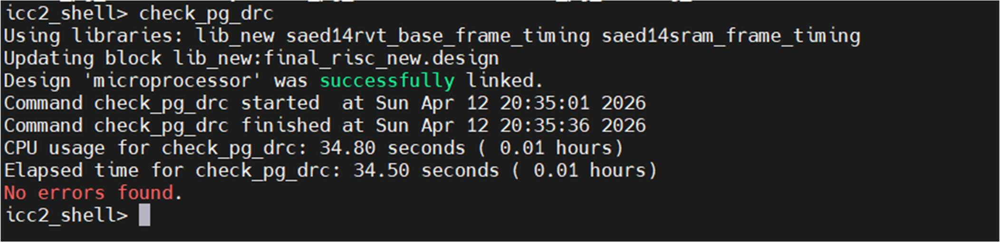

```
No errors found.   (check_pg_drc completed in 34.50 seconds)
```

#### Post-Layout Simulation

> **Figure 20: GTKWave — ICC2 Netlist Functional Verification**

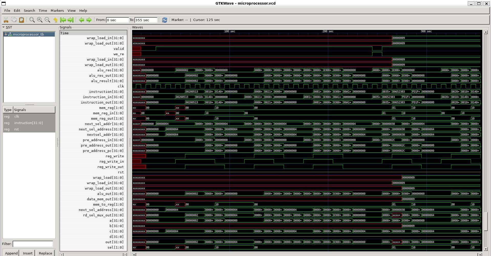

VCS simulation of the ICC2 post-layout netlist with SAED14 libraries. Simulation to 355 ns validates ALU results, instruction decoding, memory interactions, and register writes.

---

## 10. Results Summary

### Design Flow

| Stage | Tool | Result |
|---|---|---|
| RTL Design | Verilog HDL | ✅ Complete |
| Simulation | Synopsys VCS | ✅ All 8 tests pass |
| Synthesis | Design Compiler | ✅ 137,197.96 µm² total area |
| Formal Verification | Formality | ✅ 88/88 compare points |
| STA Pre-ECO | PrimeTime | ⚠️ 263 hold violations |
| ECO Fix | PrimeTime | ✅ 95.8% fixed (252/263) |
| STA Post-ECO | PrimeTime | ⚠️ 11 remaining (SRAM only) |
| Floorplan | ICC2 | ✅ Dual SRAM macro placement |
| Power Plan | ICC2 | ✅ PDN complete |
| Placement | ICC2 | ✅ Standard cells placed |
| CTS | ICC2 | ✅ Balanced clock tree |
| Routing | ICC2 | ✅ DRC-clean |

### Area Summary

| Metric | Value |
|---|---|
| Combinational Cell Area | 571.25 µm² |
| Sequential Cell Area (264 FFs) | 281.32 µm² |
| SRAM Macro Area (×2) | 134,872.81 µm² |
| ECO Buffer Area | +390.01 µm² |
| **Total Design Area** | **137,197.96 µm²** |

### Timing Summary

| Metric | Value |
|---|---|
| Target Clock | 200 MHz (5.0 ns) |
| Critical Path (REGS setup) | 6.19 ns — 75 logic levels |
| Setup Slack | +0.01 ns ✅ MET |
| Hold WNS Pre-ECO | -0.262 ns |
| Hold WNS Post-ECO | -0.040 ns (SRAM paths only) |
| Post-ECO Hold Violations | 11 (SRAM macro paths) |

---

## 11. Conclusion

This project successfully demonstrates the complete **RTL-to-GDSII ASIC design flow** for a 5-stage pipelined RV32I RISC-V processor with UART peripheral on **SAED 14nm**.

**Key achievements:**
- ✅ Fully functional 5-stage pipelined RV32I processor — all simulation tests pass
- ✅ Logic synthesis complete — 137,197.96 µm² total area
- ✅ Formal verification — 88/88 compare points, RTL ≡ netlist
- ✅ ECO fixing — 95.8% of hold violations resolved (1,098 buffer insertions)
- ✅ Complete physical design — floorplan → power → placement → CTS → routing
- ✅ DRC-clean GDSII layout ready for tape-out

The 11 remaining hold violations are confined to SRAM black-box macro address paths and would be resolved with accurate memory timing characterisation in a production tape-out scenario.

---

## 12. Acknowledgements

I'd like to sincerely thank my teammates for their hard work, collaboration, and dedication throughout this project — **Sreehari R**, **Karthika GS**, **Abhinav P**, **MP Fardeen**, and **Joel M Jacob**. Every stage of this flow, from writing RTL to getting through physical design, was a team effort and I'm grateful to have worked alongside all of you.

A special thanks to our faculty advisor **Dr. Raghunath G** for his guidance, expertise, and support throughout the course of this project.

---

## 13. References

1. RISC-V International, *"The RISC-V Instruction Set Manual, Volume I: Unprivileged ISA,"* Version 20191213, 2019.
2. D. Patterson and A. Waterman, *"The RISC-V Reader: An Open Architecture Atlas,"* Strawberry Canyon LLC, 2017.
3. D. Harris and S. Harris, *"Digital Design and Computer Architecture: RISC-V Edition,"* Morgan Kaufmann, 2020.
4. Synopsys, Inc., *"Design Compiler User Guide,"* Version V-2023.12, 2023.
5. Synopsys, Inc., *"PrimeTime User Guide,"* Version V-2023.12, 2023.
6. Synopsys, Inc., *"IC Compiler II User Guide,"* Version V-2023.12, 2023.
7. Synopsys, Inc., *"Formality User Guide,"* Version V-2023.12, 2023.
8. SAED 14nm EDK Standard Cell Library Documentation, Synopsys, 2023.
9. arhamhashmi01, *"rv32i-pipeline-processor,"* GitHub. https://github.com/arhamhashmi01/rv32i-pipeline-processor
10. J. L. Hennessy and D. A. Patterson, *"Computer Architecture: A Quantitative Approach,"* 6th ed., Morgan Kaufmann, 2017.

---

<div align="center">

Made with ❤️ at **Vellore Institute of Technology** — SENSE Dept., Micro and Nanoelectronics

</div>
